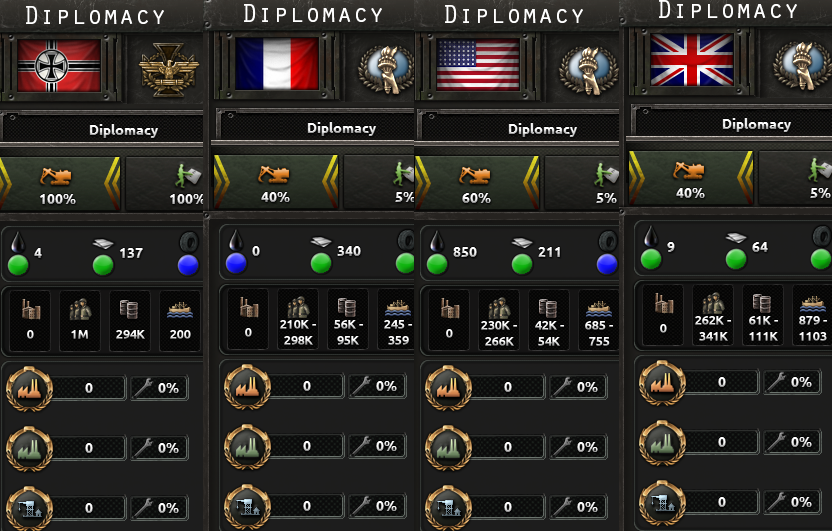

# No Factories at Game Start

This mod removes every single factory at the start dates 1936 & 1939. The only way to acquire factories from then on is focuses - or trading resources away (I guess you could also use cheats). Conquest is only an option if you start with a decent army and your victim built factories.

# Download

Either download it on this Release page directly - or via Steam: https://steamcommunity.com/sharedfiles/filedetails/?id=3242698147
